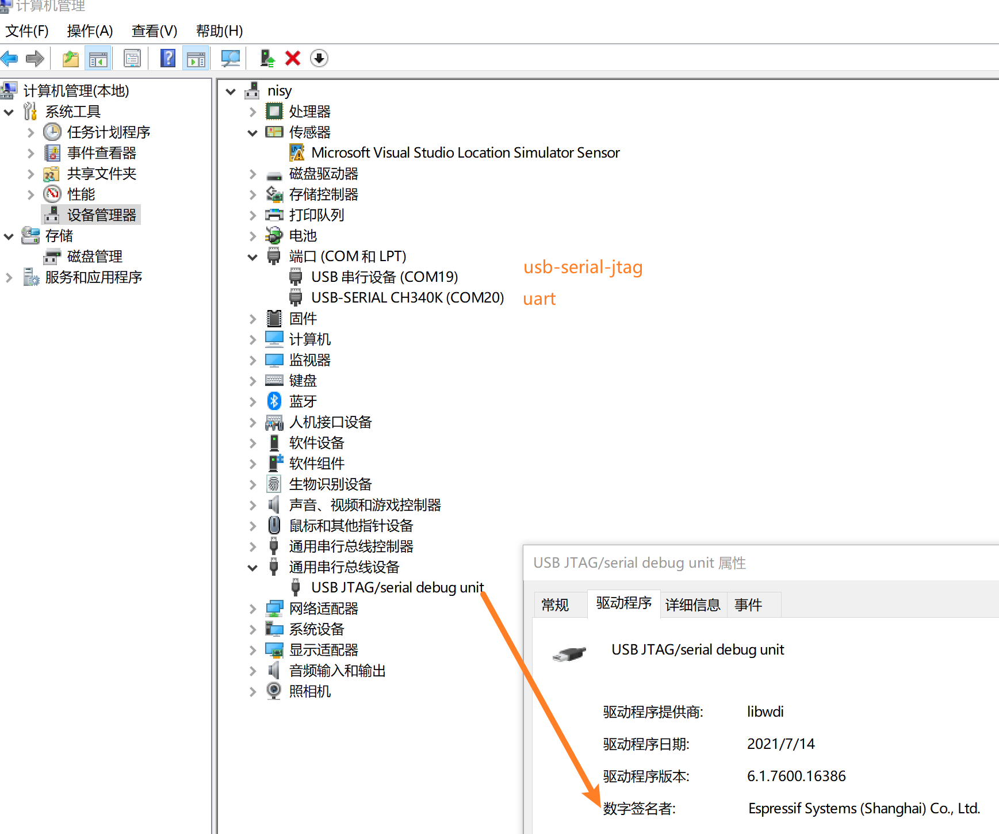
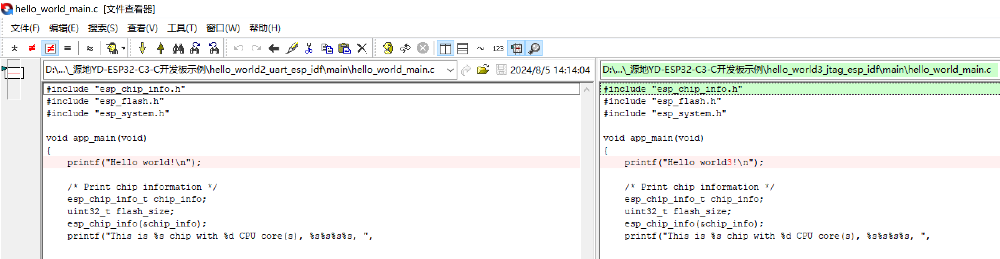
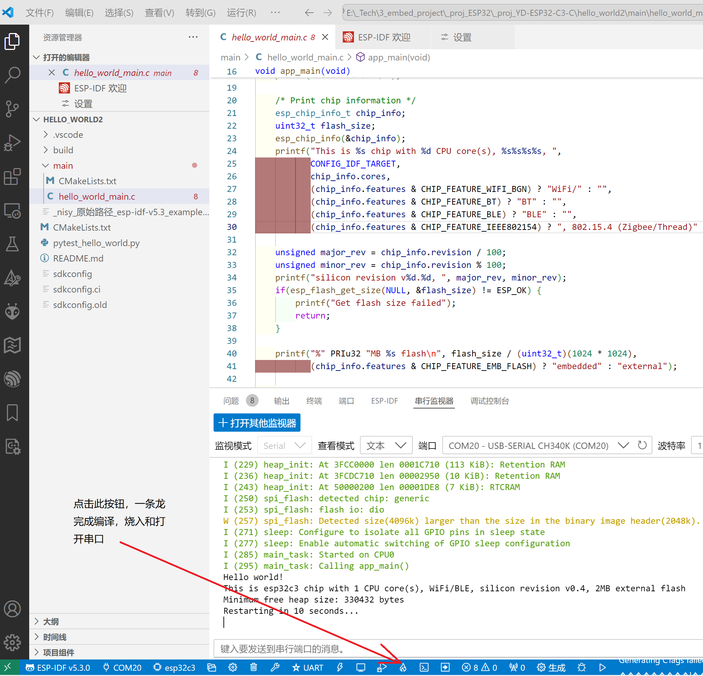
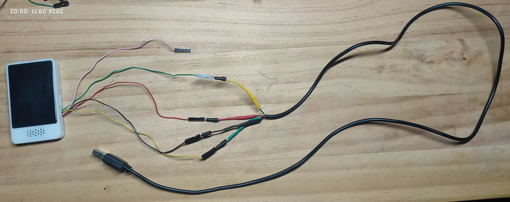
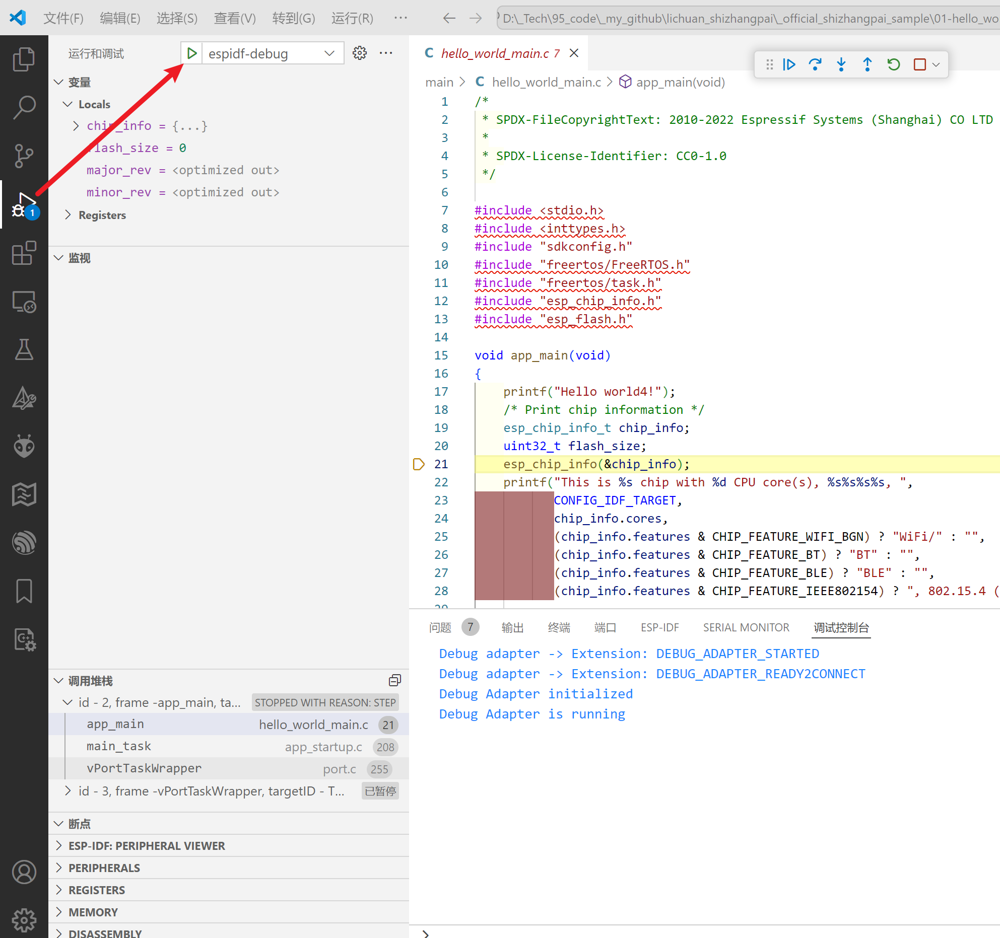

## 内容 

文件夹|内容简介
---|:--:
_official_shizhangpai_sample  |  立创-实战派开发板

## 开发环境

* ESP-IDF 5.3 
* vscode +esp-idf 插件

立创实战派开发板(或源地YD-ESP32-C3-C开发板)的2个USB口安装驱动后,效果如下:

## esp-idf 开发环境的验证project

如下是2个工程，分别使用不同方式升级，C代码部分仅仅只有如下差异，以分别区分：

### uart串口升级软件的验证project

vscode直接打开<hello_world2_uart_esp_idf>，然后点击如下按钮一气呵成（注意：串口的端口号根据你自己电脑的实际端口号而修改）：

### jtag升级软件和debug的验证project

实战派连接到一根USB-A的数据线,如下所示:

vscode直接打开<hello_world3_jtag_esp_idf>，仍然如上（其中代码部分的调试器的配置是 launch.json）,升级时会提示打开openocd,点击确认即可,会完成JTAG升级.

点击如下启动单步调试:

